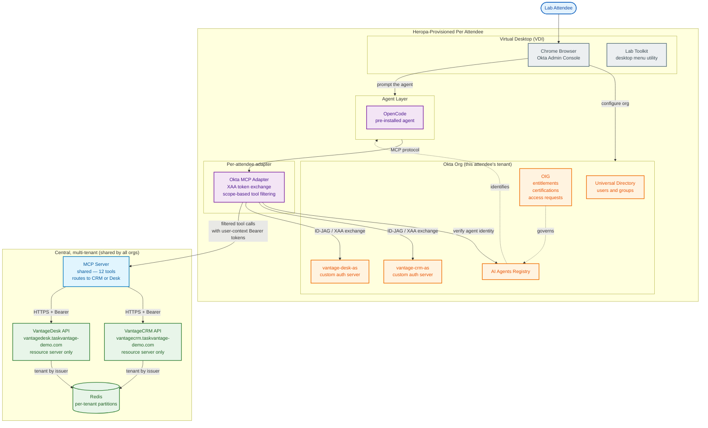

# TaskVantage AI Agents Tech Camp — Lab Architecture

This is your reference for what is running in your environment, where each component lives, and the state it starts in.

> **Hosting model (ADR-0001):** VantageCRM and VantageDesk are **one central, multi-tenant,
> API-only deployment** that every attendee's Okta org connects to — *not* a per-attendee copy.
> They are resource servers only: no browser login, no app UI, no per-app OIDC client. Every
> interaction is an agentic API call carrying a Bearer access token; the app resolves which tenant
> (org) the call belongs to from the token's **issuer**. Your **agent and Okta MCP Adapter remain
> per-attendee**, while the **MCP server is one central, shared service** (ADR-0002) that every
> attendee's adapter connects to. The "tour it in a browser" moments (Modules 1.5 / 1.6 / 4.10) are
> delivered out-of-band as rendered screenshots or via the **Lab Toolkit**, which calls the API as each user.

---

## Architecture diagram

---

## Component reference

### Infrastructure layer

| Component | Role | Hosted on | State at lab start | First built / touched |
| --- | --- | --- | --- | --- |
| **Virtual Desktop (VDI)** | The attendee's workstation. Runs the browser used for **Okta Admin Console** tasks, plus the **Lab Toolkit** desktop utility for environment checks, persona reads, and agent tool calls. | Heropa | Fully provisioned. | Lab 1 |
| **Per-attendee Okta MCP Adapter** | The attendee's own Okta MCP Adapter process. Stays per-attendee — it holds the org's agent secrets and performs per-org XAA token exchange. The MCP server it connects to is **central/shared** (see the central layer below). | Heropa (per attendee) | Provisioned; inactive until an agent is registered. | Lab 1.7 / Lab 3 |
| **Lab Toolkit** | A single desktop menu utility that fronts every command-line action in the camp: environment check, persona-scoped CRM/Desk reads, agent tool listing and invocation (with optional XAA token-exchange view), the access log, and CRM resource setup. Each menu choice prints the underlying call and result. | VDI desktop | Present on the desktop, ready to run. | Lab 1.7 |

### Central application layer (shared by all attendee orgs)

| Component | Role | Hosted on | State at lab start | First built / touched |
| --- | --- | --- | --- | --- |
| **VantageCRM** | Custom-built fake CRM (Accounts, Contacts, Opportunities). Stand-in for Salesforce / HubSpot. **API-only resource server**; applies row-level filtering from the token's `sub` + `groups`. Multi-tenant: data partitioned per org, identical seed per tenant. | Central — `https://vantagecrm.taskvantage-demo.com` | **Prebuilt and running**, shared by every attendee org. | Lab 1.5 (tour, out-of-band) |
| **VantageDesk** | Custom-built fake ITSM (Tickets, Incidents, Knowledge Base). Stand-in for ServiceNow / Jira Service Management. **API-only resource server**; access is by scope only (tenant-partitioned). | Central — `https://vantagedesk.taskvantage-demo.com` | **Prebuilt and running**, shared by every attendee org. | Lab 1.6 (tour, out-of-band) |
| **Tenant state (Redis)** | Per-tenant data partitions for both apps (keyed by org). Reseeded per tenant on first request; resettable per tenant. | Central | Running. | n/a |
| **MCP Server** | The single shared endpoint exposing the **12-tool** catalog (`crm.lookup_account`, `itsm.create_ticket`, …). A stateless bearer-forwarding proxy: every attendee's adapter connects to it, and it routes each call to the central VantageCRM/VantageDesk API with the user-context Bearer token. No per-org state or secrets, so it is safely shared (ADR-0002). | Central — `https://mcp.taskvantage-demo.com` | **Prebuilt and running**, shared by every attendee. | Lab 1.7 |

### Okta org (per attendee)

| Component | Role | Hosted on | State at lab start | First built / touched |
| --- | --- | --- | --- | --- |
| **Universal Directory** | Holds the lab personas (Alex, Susan, Kim, Frank, Sally) and their group memberships. The agent acts on behalf of these users. | Okta org | Fully populated. | Lab 1.3 |
| **AI Agents Registry** | First-class identity store for AI agents in Universal Directory. Agents registered here have owners, credentials, and managed connections. | Okta org | Empty. | Lab 2 |
| **vantage-crm-as** | Custom authorization server for VantageCRM. Issues scoped access tokens (`crm.accounts.read`, `crm.opportunities.write`, etc.) with the **constant audience `api://vantage-crm`** after XAA exchange. Its **access policy** maps groups → scopes, and the token includes a **`groups`** claim. | Okta org | **Prebuilt** — full scope set, audience, access policy. | Lab 1.9 (review) |
| **vantage-desk-as** | Custom authorization server for VantageDesk (audience `api://vantage-desk`, ITSM scope set). Trusted automatically by the central app via this org's JWKS — no re-enrollment. | Okta org | **Does not exist.** | **Lab 4 (built by attendee)** |
| **vantage-crm-as access policy** | Token-issuance rules on the auth server: which groups receive which scopes (e.g. only `IT Help Desk` gets the ITSM scopes). This is what gates access — there is no app sign-in policy, because no human signs in to the API-only apps. | Okta org | **Prebuilt** for CRM. | Lab 1.10 (review) |
| **vantage-desk-as access policy** | Same, for VantageDesk. | Okta org | **Does not exist.** | **Lab 1.10 / Lab 4 (built by attendee)** |
| **OIG (Identity Governance)** | Entitlement bundles, access request workflows, certification campaigns. Governs agent access to scopes the same way it governs human access to apps. | Okta org | Preconfigured baseline; bundles for the agent are built in Lab 5. | Lab 5 |

### Adapter + agent layer (per attendee)

| Component | Role | Hosted on | State at lab start | First built / touched |
| --- | --- | --- | --- | --- |
| **Okta MCP Adapter** | Policy enforcement point between agent and the central MCP server. Verifies agent identity, filters the tool catalog by user entitlement, performs XAA token exchange so backend calls hit the central apps as the user. | Per-attendee (Heropa) | **Prebuilt** but inactive — no agent registered yet, so no requests pass policy. | Lab 3 (filtering); Lab 4 (XAA) |
| **OpenCode agent (primary)** | Open-source AI coding agent, **pre-installed and configured on the VDI** and pointed at the attendee's adapter. Registered manually in Okta in Lab 2; this is the agent the rest of the camp uses. | VDI (Heropa-provisioned) | **Installed and ready**; identity not yet registered. | Lab 2 |

---

## How to read the diagram

**Solid arrows** are data flow — actual API calls or HTTP traffic. Follow them to trace what happens when an attendee prompts the agent.

**Dotted arrows** are trust and governance relationships — configuration, identity verification, and policy. They are not invoked per-request; they shape the rules that solid arrows must obey.

**Color groupings:**
- **Blue (user)** — the attendee
- **Grey (infrastructure)** — Heropa-provisioned hosts and tools
- **Orange (Okta core)** — anything inside the Okta org
- **Purple (workflow)** — agents and the adapter (decision-making layers)
- **Light blue (action)** — the MCP server (executes tool calls)
- **Green (resource)** — the central apps + tenant state that hold the actual data

**Central vs per-attendee:** the green **Central** box (the shared MCP server, VantageCRM, VantageDesk, Redis) is **one shared deployment** for the whole room; the **agent, Okta MCP Adapter, and the attendee's Okta org** (in the Heropa box) are per-attendee. A backend call carries the attendee's user-context token, and the central apps resolve the tenant from the token **issuer**.

**Asymmetry by design:** `vantage-crm-as` and its access policy are prebuilt; the VantageDesk equivalents are missing. Each module of the camp closes one of these gaps. By the end of Lab 5, both auth servers + access policies + governance are identically configured for the two apps.
