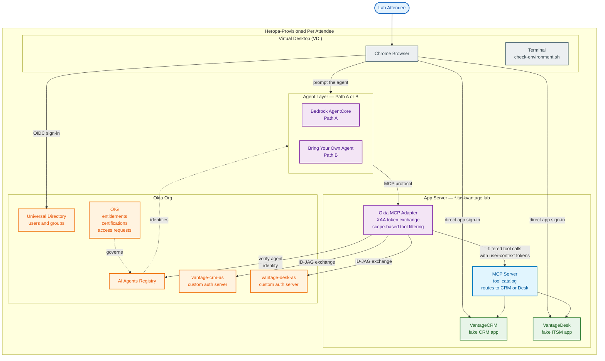

# TaskVantage AI Agents Tech Camp — Lab Architecture

This is your reference for what is running in your environment, where each component lives, and the state it starts in.

---

## Architecture diagram

---

## Component reference

### Infrastructure layer

| Component | Role | Hosted on | State at lab start | First built / touched |
| --- | --- | --- | --- | --- |
| **Virtual Desktop (VDI)** | The attendee's workstation. Runs the browser used for admin tasks and end-user simulation, plus a terminal for scripts. | Heropa | Fully provisioned. `/etc/hosts` pre-populated with `*.taskvantage.lab` entries pointing to the App Server. | Lab 1 |
| **App Server** | Single host running three processes: VantageCRM, VantageDesk, and the MCP Server. Wildcard TLS cert for `*.taskvantage.lab` is baked into the image. | Heropa | Fully provisioned and running. | Lab 1 |
| **`check-environment.sh`** | One-shot script that verifies network reachability, validates TLS, and exports environment variables for subsequent labs. | VDI desktop | Present on the desktop, ready to run. | Lab 1.7 |

### Okta org

| Component | Role | Hosted on | State at lab start | First built / touched |
| --- | --- | --- | --- | --- |
| **Universal Directory** | Holds the lab personas (Alex, Susan, Kim, Frank, Sally) and their group memberships. The agent acts on behalf of these users. | Okta org | Fully populated. | Lab 1.3 |
| **AI Agents Registry** | First-class identity store for AI agents in Universal Directory. Agents registered here have owners, credentials, and managed connections. | Okta org | Empty. | Lab 2 |
| **vantage-crm-as** | Custom authorization server for VantageCRM. Issues scoped access tokens (`crm.accounts.read`, `crm.opportunities.write`, etc.) after XAA exchange. | Okta org | **Prebuilt** — full scope set, audience, and access policies. | Lab 1.9 (review) |
| **vantage-desk-as** | Custom authorization server for VantageDesk. Same role as `vantage-crm-as` but for the ITSM scope set. | Okta org | **Does not exist.** | **Lab 4 (built by attendee)** |
| **VantageCRM Authentication Policy** | Per-app sign-in policy enforcing MFA when a user authenticates to VantageCRM. | Okta org | **Prebuilt** — Password + Another factor required. | Lab 1.10 (review) |
| **VantageDesk Authentication Policy** | Per-app sign-in policy enforcing MFA on VantageDesk. | Okta org | **Does not exist.** | **Lab 1.10 (built by attendee)** |
| **OIG (Identity Governance)** | Entitlement bundles, access request workflows, certification campaigns. Governs agent access to scopes the same way it governs human access to apps. | Okta org | Preconfigured baseline; bundles for the agent are built in Lab 5. | Lab 5 |

### Application layer

| Component | Role | Hosted on | State at lab start | First built / touched |
| --- | --- | --- | --- | --- |
| **VantageCRM** | Custom-built fake CRM (Accounts, Contacts, Opportunities). Stand-in for Salesforce / HubSpot. Enforces row-level access based on the authenticated user. | App Server, `https://vantagecrm.taskvantage.lab` | **Prebuilt** — OIDC client, auth server, auth policy, all wired. | Lab 1.5 |
| **VantageDesk** | Custom-built fake ITSM (Tickets, Incidents, Knowledge Base). Stand-in for ServiceNow / Jira Service Management. | App Server, `https://vantagedesk.taskvantage.lab` | **Minimum config** — OIDC client for sign-in only. Auth server, auth policy, managed connection, and OIG entitlements all missing. | Lab 1.6 (tour); built incrementally Labs 1.10, 2, 4, 5 |
| **MCP Server** | Single endpoint at `https://mcp.taskvantage.lab` exposing a catalog of tools (`crm.lookup_account`, `itsm.create_ticket`, etc.). Routes calls to VantageCRM or VantageDesk based on the tool. | App Server | **Prebuilt** — running with 14 tools registered, no auth checks of its own. | Lab 1.7 |
| **Okta MCP Adapter** | Policy enforcement point between agent and MCP Server. Verifies agent identity, filters the tool catalog by user entitlement, performs XAA token exchange so backend calls hit the apps as the user. | App Server | **Prebuilt** but inactive — no agent is registered yet, so no requests pass policy. | Lab 3 (filtering); Lab 4 (XAA) |

### Agent layer

| Component | Role | Hosted on | State at lab start | First built / touched |
| --- | --- | --- | --- | --- |
| **Bedrock AgentCore agent (Path A)** | Amazon-hosted agent runtime. Imported into Okta via the Bedrock connector in Lab 2. | AWS (Heropa-provisioned) | Provisioned for Path A attendees only. Configuration is "agent built, identity not yet registered." | Lab 2, Path A |
| **Bring-your-own agent (Path B)** | Any agent runtime the attendee chooses (LangChain, Vercel AI, custom). Connects to the adapter at the MCP endpoint. | Anywhere the attendee runs it | Not provisioned. Path B attendees register the agent manually in Lab 2 and point it at the adapter. | Lab 2, Path B |

---

## How to read the diagram

**Solid arrows** are data flow — actual API calls or HTTP traffic. Follow them to trace what happens when an attendee prompts the agent.

**Dotted arrows** are trust and governance relationships — configuration, identity verification, and policy. They are not invoked per-request; they shape the rules that solid arrows must obey.

**Color groupings:**
- **Blue (user)** — the attendee
- **Grey (infrastructure)** — Heropa-provisioned hosts and tools
- **Orange (Okta core)** — anything inside the Okta org
- **Purple (workflow)** — agents and the adapter (decision-making layers)
- **Light blue (action)** — the MCP server (executes tool calls)
- **Green (governance / resource)** — the fake apps that hold the actual data

**Asymmetry by design:** VantageCRM, `vantage-crm-as`, and the VantageCRM auth policy are all prebuilt. Their VantageDesk equivalents are missing or minimal. Each module of the camp closes one of these gaps. By the end of Lab 5, both columns of the architecture are identically configured.
