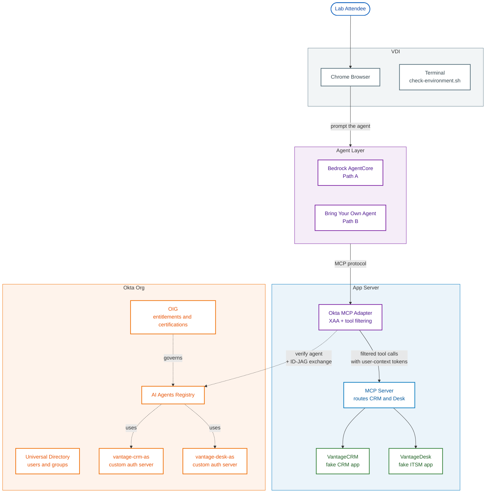

# Lab Architecture Diagram — Iteration v8

## Change in this iteration

**Dropped the `Browser → CRM` direct sign-in edge.** With MCP only constrained by the incoming edge from Adapter, Mermaid should now place it directly below Adapter, eliminating the crossing with `Adapter → MCP`.

Trade-off: the diagram no longer shows that users can sign into VantageCRM/VantageDesk directly. The lab text already covers this (Labs 1.5, 1.6 walk through direct sign-in as part of the environment tour), and the agent-mediated path is the architecture story this diagram is for.

If you want direct sign-in back, two options that won't re-tangle the layout:
- A small text label outside the diagram (e.g., "Users can also sign in to VantageCRM/VantageDesk directly via the browser")
- A dotted line from Browser that lands on the App Server subgraph as a whole, not a specific node inside it

---

