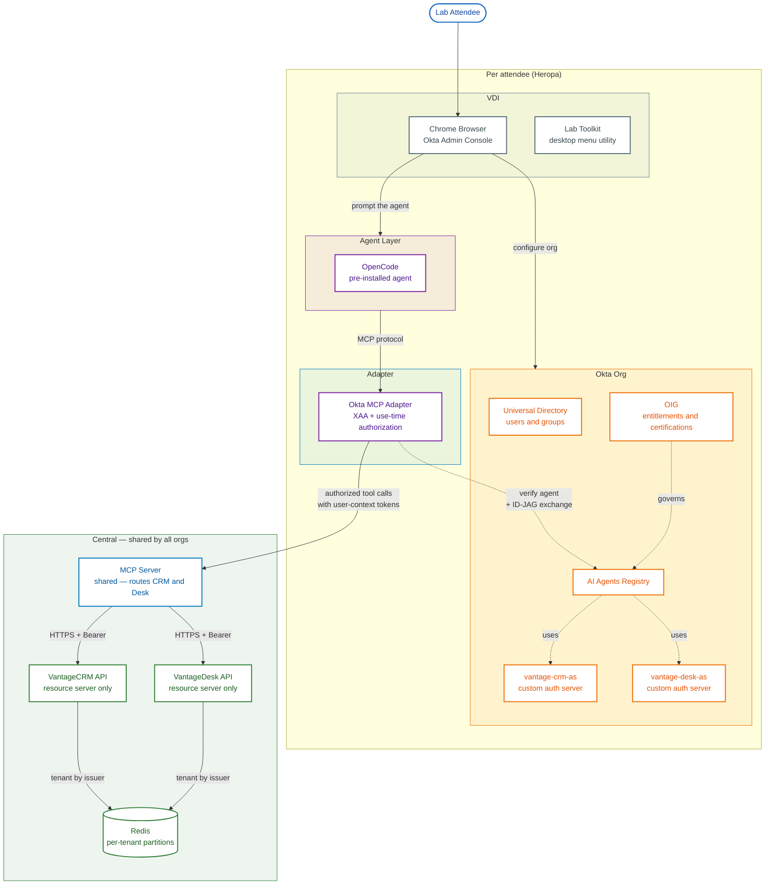

# Lab Architecture Diagram — Iteration v10 (central apps + central MCP server)

## Change in this iteration

**Reflects ADR-0001 + ADR-0002.** VantageCRM and VantageDesk are **one central, multi-tenant,
API-only deployment** shared by every attendee org, drawn in a separate `Central` subgraph (with
Redis for per-tenant state). The **MCP server is now also central/shared** (ADR-0002) and sits in
that `Central` subgraph — a stateless bearer-forwarding proxy every attendee's adapter connects to.
Only the **Okta MCP Adapter** remains the per-attendee edge.

**Removed the `Browser → CRM/Desk` direct sign-in concept entirely.** The apps are resource
servers with no human login and no UI, so there is no direct-sign-in edge to add back. The
browser is only used for the **Okta Admin Console**; the Module 1.5 / 1.6 "tour the apps" moments
are delivered out-of-band (screenshots / the Lab Toolkit), not as a browser app login.

This is the canonical source for the rendered diagram in `../lab-architecture.md` — keep the two in
sync.

---

